# Lab 2 — Polling and Interrupts (ET4047)

**Module:** ET4047 · **Lab No.:** Lab 2 · **Author:** Luke Griffin
**University of Limerick — Department of Electronic & Computer Engineering**

📄 **View the full lab report online:** https://lukegrif.github.io/W03-LAB-ET4047/

---

## Introduction

In this lab we explore two fundamental approaches for handling input events in
embedded systems: **polling** and **interrupts**. We use an Arduino (Uno or Nano)
with a breadboard as our platform. By the end of the lab you will understand what
polling and interrupts are, and you will work through a series of short exercises
that build on each other using push buttons and LEDs.

- **Polling** — the CPU continuously checks an input in a loop to see whether an
  event has occurred. Simple and predictable, but it keeps the processor busy and
  can add latency.
- **Interrupts** — an external event signals the CPU when attention is needed,
  pausing the main program to run a short **Interrupt Service Routine (ISR)**.
  Efficient and low-latency, but requires more careful design.

> Polling is like a teacher repeatedly asking every student whether they have a
> question. Interrupts are like students raising their hands — the teacher (CPU)
> only responds when signalled.

---

## Lab Objectives

The lab builds up in small steps, one exercise at a time:

| # | Exercise | Focus |
|---|----------|-------|
| 1 | Getting Started | Arduino essentials — `setup()`, `loop()`, pin modes, `digitalWrite()`, Serial Monitor |
| 2 | Button Debounce | Read a button cleanly by removing contact bounce in software |
| 3 | Polling | Continuously check a button in the main loop |
| 4 | Interrupts | React to a button with a hardware interrupt and an ISR |
| 5 | Two Buttons | A second button controls a second LED |

---

## Hardware Setup

Most exercises use the same breadboard circuit — physical push buttons and LEDs
wired to the Arduino (no shield).

- **2 LEDs:** LED 1 anode → `D4`, LED 2 anode → `D5`. Each cathode → GND through
  its own **220 Ω** resistor.
- **Push button S1:** one leg → `D2`, other leg → GND. Used from Exercise 2 on.
- **Push button S2:** one leg → `D3`, other leg → GND. Used in Exercise 5 only.

All buttons use `INPUT_PULLUP`, so a pin reads **HIGH when idle** and **LOW when
pressed** (active-low) — no external resistor needed. Pins `D2` and `D3` are used
because they are the Arduino's external interrupt pins (required for Exercise 4).

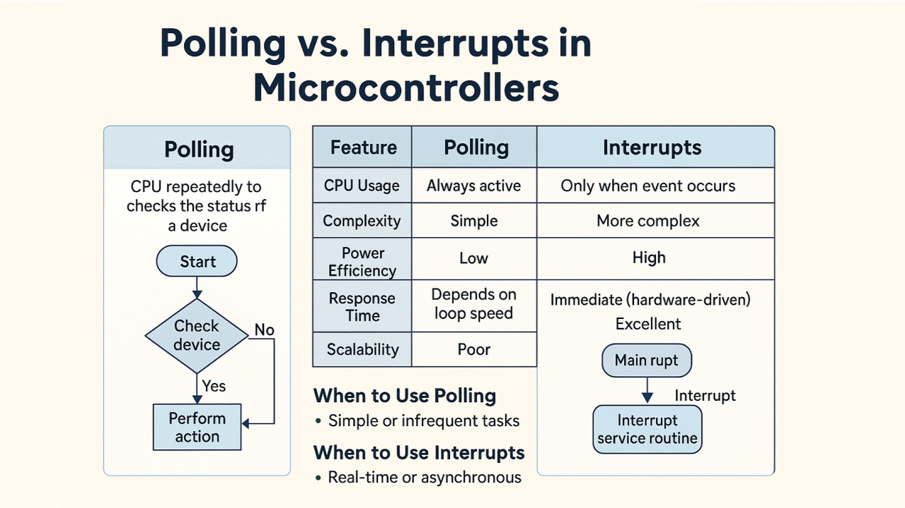

---

## Exercise 1 — Getting Started

Get familiar with the Arduino essentials: the `setup()` and `loop()` functions,
setting pin modes, driving outputs with `digitalWrite()`, and printing to the
Serial Monitor. This program blinks two LEDs alternately and prints what it is doing.

**Wiring diagram**

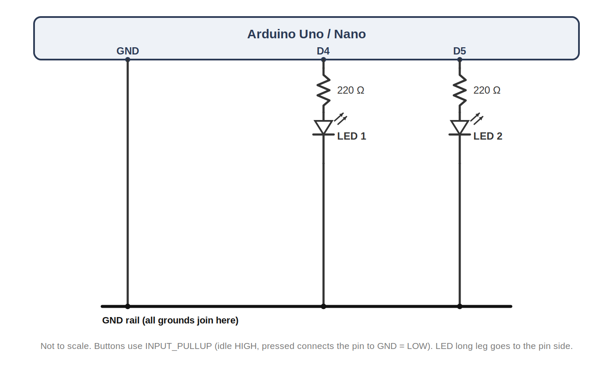

**Visuino setup**

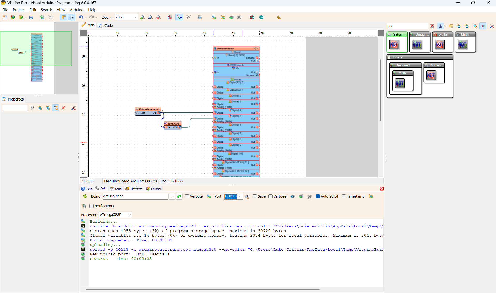

**Wokwi setup**

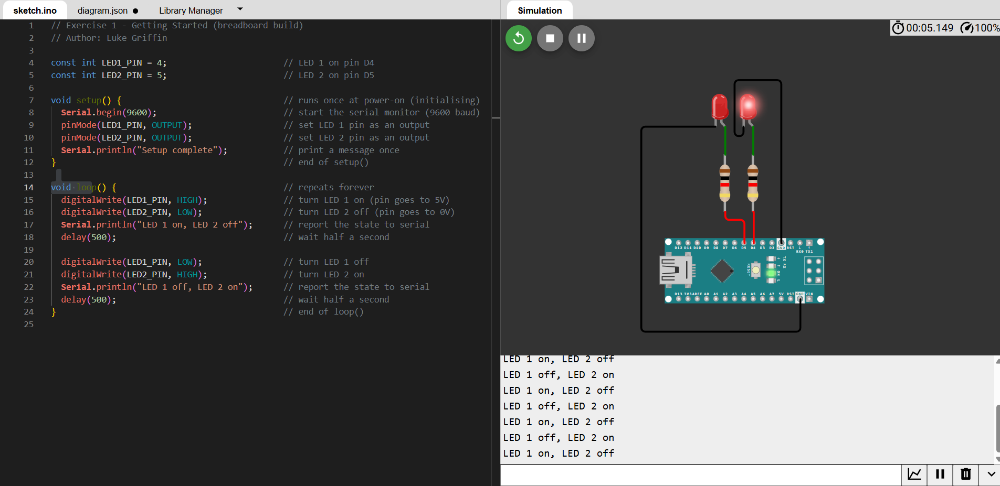

**Physical breadboard**

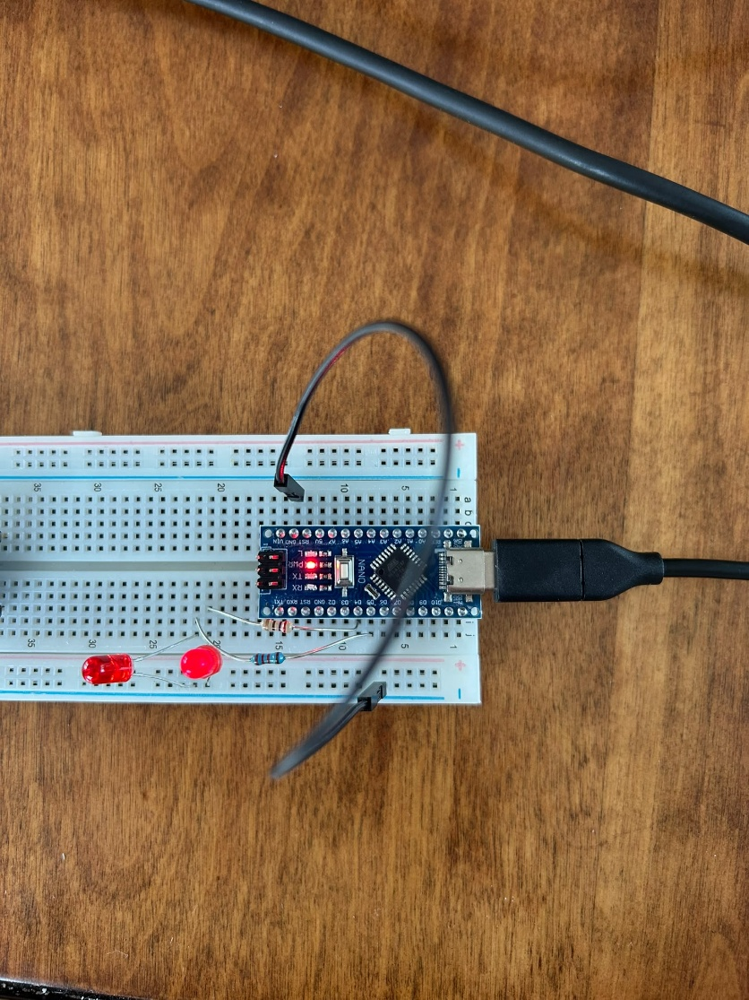

**Code**

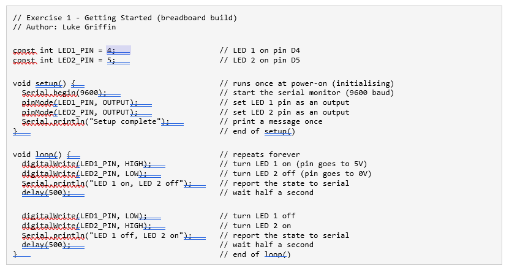

---

## Exercise 2 — Button Debounce

Introduces **debounce**: making a single button press register only once. A
mechanical button's contacts bounce for a few milliseconds, so one physical press
can be read as many. We only accept a new state once the reading has stayed steady
for a short settling time (here **50 ms**). Uses one button (S1 on `D2`) and one
LED (LED 1 on `D4`).

**Wiring diagram**

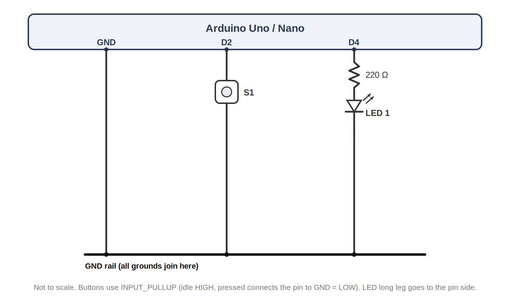

**Code**

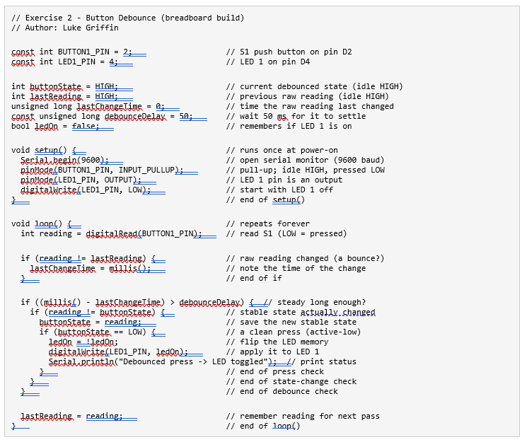

---

## Exercise 3 — Polling

Use polling to detect when the button is pressed, then turn both LEDs on for a
short duration. The Arduino continuously loops, checking the button state. No
interrupts are used.

**Wiring diagram**

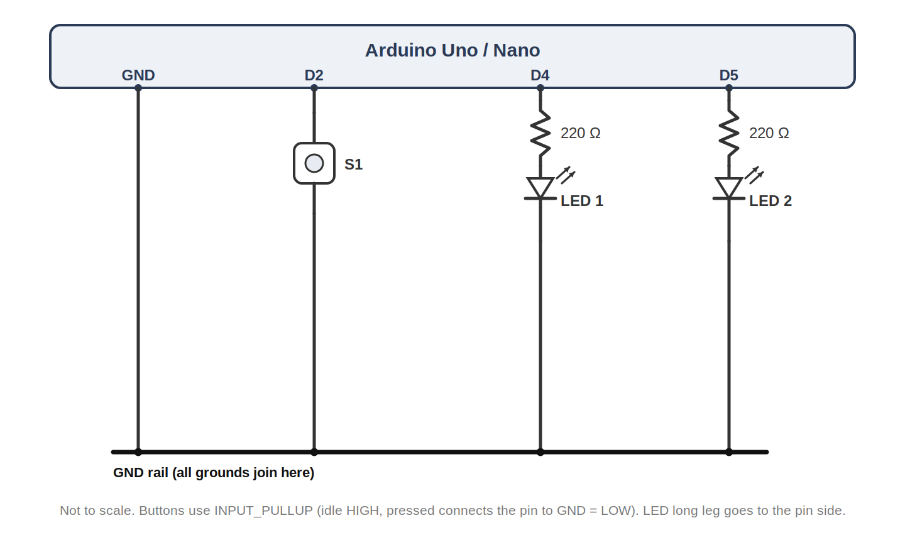

**Code**

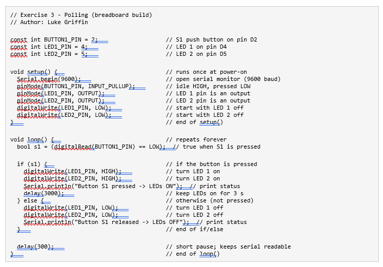

**Expected serial output**

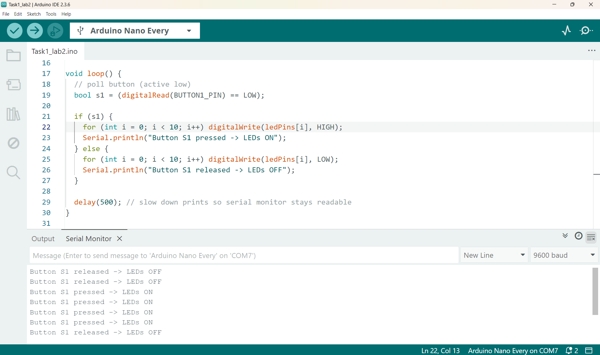

---

## Exercise 4 — Interrupts

Re-implement the same behaviour using an external interrupt. The Arduino no longer
checks the button in the main loop; pressing the button triggers an ISR that sets a
flag, and the main loop responds to that flag. Uses the same wiring as Exercise 3.

- `volatile bool s1Flag` signals from the ISR to the main loop.
- `attachInterrupt(... FALLING)` runs the ISR on the falling edge (a press).
- The ISR is kept short — it only sets the flag, with no prints or delays.

**Code**

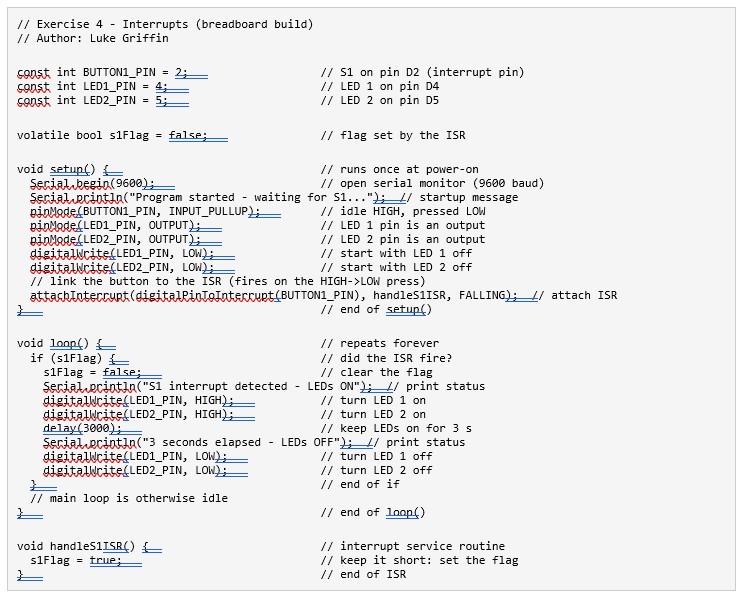

**Expected serial output**

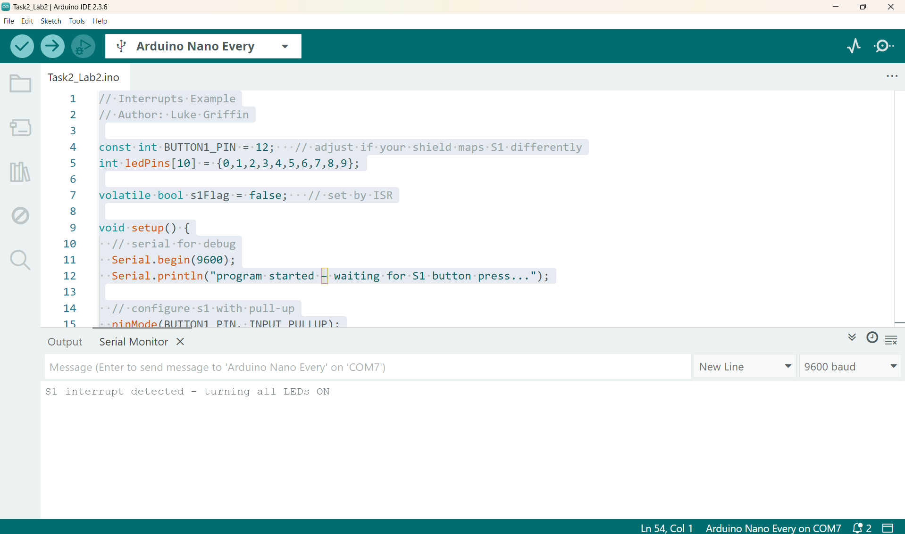

---

## Exercise 5 — Two Buttons

Add a second push button (S2 on `D3`), one button per LED: S1 lights LED 1 and S2
lights LED 2. Because both buttons are on interrupt pins (`D2` and `D3`), the same
circuit works for both the polling and interrupt versions — only the code changes.

**Wiring diagram**

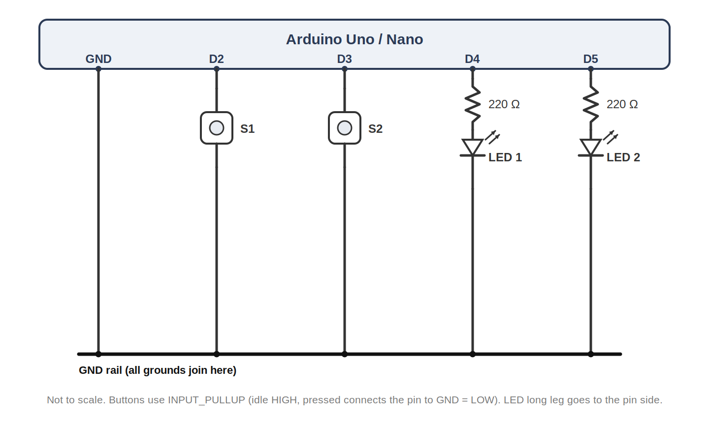

**Polling code (provided)**

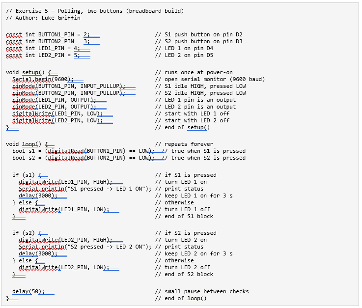

**Your task:** using the polling code above and the interrupt code from Exercise 4,
write an interrupt-driven version so that pressing Button 1 turns on LED 1 and
pressing Button 2 turns on LED 2.

---

## Conclusion

Starting from the Arduino basics, this lab compared polling and interrupts using a
simple buttons-and-LEDs breadboard circuit.

- The Arduino runs `setup()` once, then `loop()` forever; `pinMode`,
  `digitalWrite` and the Serial Monitor are the basic tools.
- Buttons use `INPUT_PULLUP` and are active-low (idle HIGH, pressed LOW).
- **Debounce** with a short settling delay (~50 ms) makes each press register once.
- **Polling** repeatedly asks the hardware "Are you pressed?" — simple but can be
  inefficient.
- **Interrupts** let the hardware tell the software "Button pressed now!", so the
  CPU does not check unnecessarily and can do other work or sleep (ideal for power
  saving).
- Interrupt code needs care: use `volatile`, keep the ISR short, and remember the
  main code and ISR run asynchronously.

---

## Repository Contents

| Path | Description |
|------|-------------|
| `index.html` | GitHub Pages viewer that renders the full lab report PDF |
| `W03_LAB_Polling_and_Interrupts.pdf` | The lab report |
| `W03_EX1` … `W03_EX5` | Arduino sketches for each exercise |
| `images/` | Figures used in this README |
